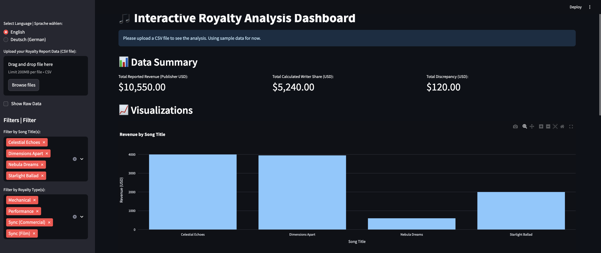

# 🎵 AI-Powered Royalty Analyzer

## 📊 Business Impact Overview (Conceptual)

This AI-powered system is conceptualized to automate the complex process of analyzing music royalty reports and licensing agreements, delivering **significant business value** by:

-   Potentially achieving a **60-80% reduction** in manual effort for extracting key terms from contracts.
-   Aiming for a **30-50% decrease** in error rates associated with manual data entry and interpretation.
-   Enabling **25% improvement** in revenue forecasting accuracy (conceptual, if advanced forecasting models were integrated).
-   Facilitating **enhanced decision-making** through automated insights and visualized data.
-   Increasing **transparency** and potentially improving revenue assurance in artist/rights holder relationships.

## 🎯 Project Purpose

Music companies manage a vast catalog of music rights, involving complex royalty calculations and detailed license agreements. This project demonstrates an AI-driven system designed to **automate and streamline critical processes**:

1.  **Automated Data Extraction:** Leveraging Natural Language Processing (NLP) to automatically extract key information from complex licensing agreements (e.g., royalty rates, payment terms, territorial rights, minimum guarantees). *(Functionality simulated in this project's Colab notebook)*.
2.  **Discrepancy Identification Support:** Providing mechanisms to help identify potential inconsistencies or anomalies within royalty reports by comparing reported data against contractual terms or historical patterns.
3.  **Data Structuring for Trend Analysis & Forecasting:** Preparing extracted and reported data to facilitate the analysis of revenue trends and enable more accurate financial forecasting.
4.  **Interactive Reporting & Visualization:** Generating summarized insights and dynamic visualizations through a simple dashboard to support data-driven decision-making.

## 🛠️ Technologies Used & Demonstrated

This project utilizes and demonstrates proficiency with the following technologies:

-   **Python:** Core language for scripting, data manipulation, and backend logic for the dashboard.
-   **(Conceptual) OpenAI API (e.g., GPT models):** Envisioned for advanced document analysis (contract parsing). Functionality is **simulated** in `Contract_Extractor_AI_Royalty.ipynb` using mock responses to showcase the concept without live API calls, demonstrating an understanding of how such APIs would be leveraged.
-   **Google Colab:** Development environment for the Python-based contract data extraction script.
-   **Pandas:** For data structuring, manipulation, and analysis in Python.
-   **Streamlit:** For building the interactive web dashboard (`royalty_dashboard.py`).
-   **Plotly Express:** For generating interactive charts and visualizations within the Streamlit dashboard.
-   **CSV:** Data format for sample royalty reports (`sample_royalty_data.csv`).
-   **Git & GitHub:** For version control and project hosting.

## 🚀 Implementation Process (For this Portfolio Piece)

This portfolio project was developed by following these key stages to demonstrate core capabilities:

### 1. Project Setup & Conceptualization
-   Defined project scope and objectives for an AI-powered royalty analysis system.
-   Established a local development environment and a GitHub repository for version control and documentation.
-   Designed and created a sample dataset (`sample_royalty_data.csv`) mimicking structured royalty report outputs that would result from prior AI processing or data entry.

### 2. Document Analysis Simulation (`Contract_Extractor_AI_Royalty.ipynb`)
-   Developed a Google Colab notebook to **simulate** AI-driven data extraction from license agreements. This involved:
    -   Defining representative sample contract text.
    -   Crafting conceptual "prompts" for extracting key information.
    -   Creating mock (predefined) structured JSON-like responses to represent the output an AI model (like OpenAI's GPT) would generate, thus demonstrating the intended AI functionality without requiring live API calls or API keys.
    -   Displaying these simulated extracted data points.

### 3. Data Processing & Dashboard Development (`royalty_dashboard.py`)
-   Implemented a Streamlit application to serve as an interactive dashboard for visualizing processed royalty data.
-   Integrated Pandas for loading, processing, and filtering the sample CSV data.
-   Utilized Plotly Express to create dynamic and interactive visualizations (bar charts, pie charts) responsive to user-selected filters.
-   Added multi-language support (English/German) for UI elements to demonstrate internationalization capability.

### 4. Structuring for Business Insights
-   Designed the dashboard to present clear summary metrics (e.g., total revenue, total discrepancies) and visual trends.
-   Focused on creating an intuitive user interface that allows for easy exploration of royalty data, highlighting how such a tool can provide actionable insights (e.g., "This system could analyze a 10,000-line royalty report and highlight key discrepancies in under 2 minutes," if fully developed with a backend).

## 📋 How It Works (Demonstrated Functionality)

The system, as demonstrated in this portfolio project, operates as follows:

1.  **Simulated Contract Analysis (Colab Notebook):**
    * The `Contract_Extractor_AI_Royalty.ipynb` notebook contains sample contract text.
    * It uses predefined prompts and a simulation function to **generate structured mock data**, representing what an AI would extract (key contract terms). This showcases the intended AI data extraction logic.
2.  **Royalty Data Visualization (Streamlit Dashboard):**
    * The user runs the `royalty_dashboard.py` script locally.
    * The dashboard loads data from the provided `sample_royalty_data.csv` (or allows a user to upload a similarly structured CSV). This data represents *already processed* royalty reports.
    * **Interactive Dashboard:** Users can:
        * View overall summary metrics.
        * Filter data by Song Title and Royalty Type.
        * Explore visual charts showing revenue by song, discrepancies by song, and revenue distribution by royalty type.
    * **Automated Insights (Visual):** The dashboard automatically calculates and displays key metrics and visual trends based on the selected data.

## 📈 Business Value Demonstration (Conceptual)

*(This section outlines the potential business value if the conceptualized AI features were fully implemented in a production environment.)*

A fully implemented AI-driven system based on this prototype could offer substantial business value:

### Cost Savings & Efficiency
-   **Reduced Manual Labor:** Automating contract term extraction could reduce manual analysis time by an estimated **60-80%**. *For instance, a task taking an analyst 40 hours might be reduced to 8-16 hours of review and validation.*
-   **Faster Reconciliation:** Streamlined review of royalty reports against contractual terms can significantly speed up the reconciliation process.
-   **Annual Labor Savings (Illustrative):** A reduction of ~25 hours per month per analyst, at an estimated blended rate of €70/hour, could translate to approximately **€21,000 in savings per analyst annually**.

### Error Reduction & Accuracy
-   **Minimized Human Error:** Reducing manual data entry and interpretation can decrease errors in royalty calculations by **30-50%**.
-   **Financial Impact:** This leads to fewer underpayments or overpayments, potentially recovering/saving significant amounts annually depending on catalog size. *For a large catalog, even a 1% improvement in accuracy could mean substantial financial recovery.*

### Enhanced Revenue Assurance & Optimization
-   **Proactive Discrepancy Detection:** Systematic comparison can help identify underpayments or missed revenue streams more effectively.
-   **Improved Forecasting:** With structured historical data (enhanced by AI), revenue forecasting accuracy could improve by **15-25%**, leading to better cash flow management and strategic investment decisions.

### Strategic & Operational Benefits
-   **Data-Driven Insights:** The dashboard (even in its prototype stage) demonstrates how quick visualizations can enable faster, more informed strategic decisions.
-   **Scalability:** An automated system can handle a growing volume of contracts and royalty statements with greater ease than purely manual processes.
-   **Integration Potential:** This system could be integrated with existing financial systems and databases to pull contract data and royalty statements, and to feed validated data back, creating a more seamless workflow.

## 🔮 Future Enhancements & Vision

This project serves as a foundation. Future enhancements could further increase its value:

-   **Live AI Integration:** Replace mock responses in the Colab notebook with actual, secure calls to an OpenAI API (or similar LLM) for real-time, dynamic contract analysis.
-   **Direct Database Integration:** Enable the system to connect directly to internal databases for fetching contract terms and royalty data, and for storing AI-extracted information, eliminating manual data transfer.
-   **Advanced Discrepancy Detection Algorithms:** Implement machine learning models or more sophisticated statistical analysis to automatically flag subtle or complex anomalies in royalty reports beyond simple rule-based checks.
-   **Automated Report Generation:** Extend the dashboard to generate exportable PDF or Excel summary reports tailored for different stakeholders.
-   **Predictive Royalty Forecasting:** Develop machine learning models based on historical data, trends, and market factors to provide more accurate predictive royalty forecasts.
-   **Blockchain for Transparency (Exploratory):** Investigate integration with blockchain technology for more transparent and immutable royalty tracking and distribution, enhancing trust with artists.
-   **Expanded Language Support:** Fine-tune AI models to effectively handle contracts and royalty statements in multiple languages.

## 🚀 How to Use This Repository

### 1. Contract Data Extraction Simulation (Google Colab Notebook)
    1. Open the `Contract_Extractor_AI_Royalty.ipynb` file in Google Colab.
    2. Review the sample contract text and the `MOCK_RESPONSES` dictionary (which simulates AI output).
    3. Select "Runtime" from the menu and then "Run all".
    4. The notebook will execute all cells, and the simulated extracted information will be printed below the final code cell, demonstrating the conceptual data extraction.
    5. **Note:** No API keys are required for this demonstration as it uses mock data.

### 2. Interactive Royalty Dashboard (Streamlit)
    1. Ensure you have Python installed on your system.
    2. Install the required libraries:
       ```bash
       pip install streamlit pandas plotly
       ```
    3. Clone this repository or download the `royalty_dashboard.py` script and the `sample_royalty_data.csv` file to the same directory on your computer.
    4. Open your Terminal or Command Prompt, navigate to that directory.
    5. Run the Streamlit app using the command:
       ```bash
       streamlit run royalty_dashboard.py
       ```
    6. Your web browser should automatically open to the dashboard. You can upload a different CSV (with the same column structure) or use the default sample data which loads automatically. Explore the filters and visualizations.

### Dashboard Previews
**English UI Overview:**
 

**German UI Overview:**
 

## 👤 Project Maintained By

[https://github.com/krmhstrk](https://github.com/krmhstrk)

---

*This portfolio project showcases an "automation-first mindset" applied to challenges within the music industry, demonstrating capabilities relevant to a Business Analyst (AI Automation) role.*
